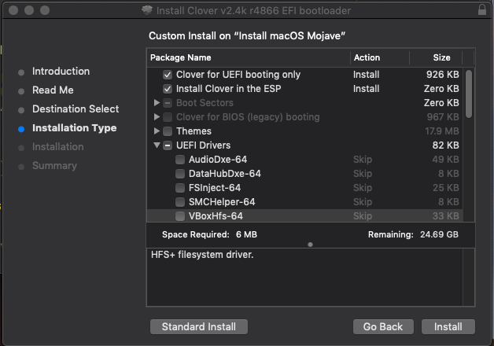
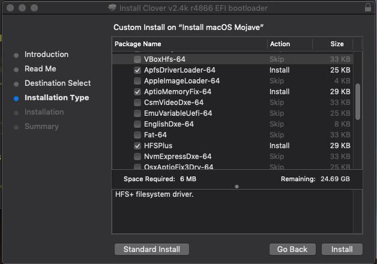

&#x200B;

# Download Clover Builder and Configurator

1. Gather the download apps including [**Clover Builder**](https://github.com/Dids/clover-builder/releases) and [**Clover Configurator**](https://mackie100projects.altervista.org/download/ccg/).
2. Clover Builder (CB) is for creation of the bootloader on the USB drive
3. Clover Configurator (CC) is to configure the config.plist file within that EFI partition which is an instruction set that configures the hackintosh.

If you are sketchy about this part, go read the section on the [Basics of the Vanilla Method.](00_Basics%20of%20the%20Vanilla%20Method.md)

4. I Installed *Clover_v2.4k_r4866.pkg*  — You may have downloaded a newer version.
5. Run Clover Installer. Once you get to the destination select, **remember to choose the USB drive** and not the default hard drive/SSD. Then remember to hit **customize**. This will enable you to select the following option in your installation.
6. Choose **Clover for UEFI Booting Only**   


###### Remember to check the "Clover for UEFI booting only"
     


1. Under **UEFI Drivers** chose the following options: 


###### You can begin by selecting 3 UEFI drivers as discussed below.

For Simplicity sake, to start off with, I will be only running 3 UEFI drivers:

1. **APfsDriverLoader-64** :  This allows the boot loader (Clover) to see and boot from APFS volumes by loading APFS.efi. Usually in conjunction with AptioMemoryFix-64.
2. **AptioMemoryFix-64** : This includes fixes for NVRAM and better memory management. This turns out to be a finicky beast. For my motherboard, I had no issues with this alone, but as I was tinkering with other boards such as a the Gigabyte Z390 I found that this caused problems. There are several other alternate drivers including OsxAptioFixDrv.efi, OsxAptioFixDrv2.efi, OsxAptioFixDrv3.efi — these are not newer versions of the other, but rather three separate variants. If AptioMemoryFix-64 gives you trouble, try one of these, but don't assume one is better than the other.
3. **HFSPlus.efi** (or VBoxHfs-64.efi) : These are required for Clover to see and boot from HFS+ volumes.  If you can’t see HFSPlus, don’t worry about it. We can install it later. Alternatively, if you see VBoxHfs-64, it does the same thing.

The above files are the most critical. I added three more drivers to enable various functions.   

**FSInject.efi** :  This was added automatically during installation so I never deleted it. It appears its function is to block files from being loaded and to inject files from pre-exit boot services for the kernel.   
**NTFS-64.efi** : This enables the boot loader to see NTFS. 7.   
**VirtualSMC-64.efi** : This is an automatic addition from the VirtualSMC kext.  


# UEFI Drivers and Kexts
Earlier, we installed the UEFI drivers. These are important drivers that get loaded before even MacOS is loaded into the system. In other words, UEFI drivers are the first drivers to be fed into the MacOS from the EFI partition as the system is starting. Then there are another set of configuration information called **Kexts**. Kext files are basically the drivers for macOS. The word “Kext” is short for *Kernel Extension*. When you boot up your machine the code contained in these kexts is automatically injected into the operating system, after the UEFI drivers get injected. It’s like having drivers contained in a single file without having to install them like on Windows. When you want to uninstall a kext all you have to do is remove it ([Source](https://hackintosher.com/blog/kext-files-macos/). A key thing to remember here is that normal Macs also use Kexts, and these are saved in */System/Library/Extensions* by default.  

But in our hackintosh, all of the modified kexts that we introduce, will be housed in the EFI partition maintained completely separately from the kexts that typically belong to MacOS. In the vanilla method, all of your kexts are stored in /EFI/Clover/kexts folder which is inside of the hidden EFI partition, completely separate from the rest of the OS. 
  
We are going to begin by gathering kexts for the Hackintosh. I’m only going to start with the bare essentials, because of the purpose is the keep the system running as close to a real Mac and lean as possible.   

**NOTE: Clover configurator has a Kext Installer that we will look at. Personally, I prefer to install my kexts manually directly into the EFI partitions' /EFI/Clover/kexts folder.


## Gathering Kexts
Most of the Kexts are available from the following repos: [Goldfish64 Repo](https://1drv.ms/f/s!AiP7m5LaOED-m-J8-MLJGnOgAqnjGw) Once the following kexts have been downloaded and unzipped, I copy them directly into the /EFI/Clover/kexts/Other within the EFI partition of the boot loader drive that was prepared by Clover Builder.


## SMC
*VirtualSMC.kext* - Emulates the SMC chip on real macs. There is an alternate version called *FakeSMC.kext* which essentially does the same thing. FakeSMC is more tried and true, and VirtualSMC is the new kid in town. VirtualSMC also comes packaged with a UEFI driver (VirtualSMC-64.efi). If you remember, we installed this one earlier when we handled the UEFI drivers. They both have hardware monitors that can be used to monitor CPU temperature, speed, GPU function etc. Install **either** VirtualSMC or FakeSMC, not both.

## Graphics
*WhateverGreen.kext, and* *Lilu.kext* Is a combined kext that incorporates the features a number of prior kexts that directly dealt with graphics from various cards and chipsets. They have now been combined to this one kext, along with its’ companion kext *Lilu.kext*.

## Ethernet
*IntelMausiEthernet.kext* - this works with most newer Intel LAN chipsets. This should work in the chipset for **Intel GbE LAN** which in in my motherboard. Your motherboard may have a different chipset. 

## Audio
*AppleALC.kext*  : This motherboard has the **Realtek ALC1220** Codec which is supported by the *AppleALC.kext*. Your board may have a different audiot chipset, in which case you need to go to your motherboard manufacturer site and look up the correct chipset and find the corresponding kext for it.

## WiFi and Bluetooth
Apple does not recognize the Intel WiFi chip so I am using a BCM93460 FenVi FV-T919 wifi/bluetooth card which should be supported directly out of the box.

## USB
*USBInjectAll.kext* - is required. You’ll want to get [USBInjectAll.kext](https://bitbucket.org/RehabMan/os-x-usb-inject-all/downloads/). If you’re on an H370, B360, and H310 Coffee Lake system, or an X79/X99/X299 you’ll likely want to make sure to include the *XHCI-unsupported.kext* as well. As of MacOS 10.11, Apple has imposed a 15 port limit on each USB controller. On Skylake and Coffeelake builds where USB 2 and 3 are handled only on XHCI, and each USB 3 port counts as 2, this limit can be reached quickly. This was one of my issues with my board. There is a way to route all USB 2 through EHCI though - utilizing [RehabMan’s FakePCIID.kext + FakePCIID\_XHCIMux.kext](https://github.com/RehabMan/OS-X-Fake-PCI-ID)  (it only works on some chipsets though, and not mine, unfortunately) which can take some of the pressure off the XHCI controller. ([Source](https://hackintosh.gitbook.io/-r-hackintosh-vanilla-desktop-guide/gathering-kexts)).  For example, it appears that while the Z370 chipset does not have EHCI controller (and all of the USBs are routed via XHCI), some of the Z390 motherboard chipsets do have the ability handle routing via EHCI.

Handling USB issues ended up being one of my biggest problems but it was resolved, thanks to the hard work of some wonderful folks who had created some amazing tools (CorpNewt, Rehabman) . See my *[Troubleshooting](07_Troubleshooting.md)* section.

So my final kext collection copied into the /EFI/Clover/kexts/other was as follows: You will note that there are multiple 10.xx folders in the kexts folder and a single “Other” folder. I deleted all of the other 10.xx folders since they are version specific, and the “Other” folder is universally accessed. Which is what I want.

```
    1. AppleALC.kext 
    2. IntelMausiEthernet.kext
    3. Lilu.kext
    4. WhateverGreen.kext
    5. VirtualSMC.kext
    6. SMCBatteryManager.kext
    7. SMCLightSensor.kext
    8. SMCProcessor.kext
    9. SMCSuperIO.kext
    10. USBInjectAll.kext
    11. XHCI-unsupported.kext
    12. GenericUSBXHCI.kext — I’m not sure whether this is redundant, but I read that this can enable injection of non-Intel USB ports. I have 2 USBc ports that are regulated via the ASMedia controller, so I activated them anyways. However it doesn’t appear to have worked. So you perhaps don’t need this.
   
    
 ```
 
# Changing Config.Plist

The config.plist is the main configuration file for the Hackintosh. In order to minimize the effects of it, I am going to delete the existing one on the EFI partition and import a new config.plist from a source.

1. Open the following [website](https://hackintosh.gitbook.io/-r-hackintosh-vanilla-desktop-guide/config.plist-per-hardware/coffee-lake) — This is the Coffee Lake Config.plist guide. Read this article carefully as it documents what you need to know about each of the parameters. If you don't have a coffee Lake processor, read the section that pertains your CPU. This is a .plist file that contains instructions for the boot loader. It can be edited either by directly modifying the code or by loading into an editor such as Clover Configurator.
2. Go to the bottom of the webpage and click this link [(sample config.plist)](https://github.com/corpnewt/Hackintosh-Guide/blob/master/Configs/CoffeeLake/config.plist)
3. This will connect you to a GitHub site. Select **[Raw]**
4. When a new page loads, Select All **[CMD-A]** and Copy the content **[CMD-C]**.
5. Now open up TextEdit or TextWrangler.
6. If using TextEdit, go to *Format* -> *Make Plain Text*
7. Paste the text in there and save the file as **config.plist** to the desktop.
8. Now ensure that the newly formatted and prepared USB drive (with Clover Installer) is ready. This USB drive should have the UEFI drivers installed in the **EFI/Clover/Drivers64UEFI** and the kexts installed in **/EFI/Clover/kexts/other**.
9. Now startup Clover Configurator and choose *Mount EFI* -> *EFI partition of USB drive* -> *Mount Partition* (if this hasn’t been done already).
10. Navigate to /EFI/Clover/config.plist and delete the existing file on the USB drive. This file was automatically created by the Clover Installer and is **not** what we want. Copy the **config.plist** that you created by cutting and pasting text from the website above from Corpnewt to the location /EFI/Clover/config.plist. Choose yes to overwrite if asked.
11. Right click on the config.plist and choose *Open with* -> *Clover Configurator*.

If you want to find out more information on how to configure Clover Configurator, please read this article I wrote on a [Walkthrough of Clover Configurator](08_Walkthrough_Clover_Configurator.md)
