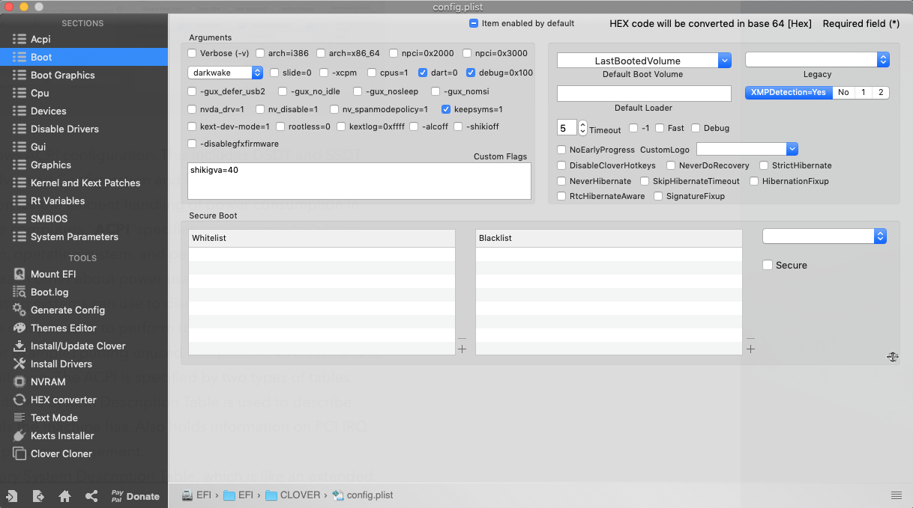
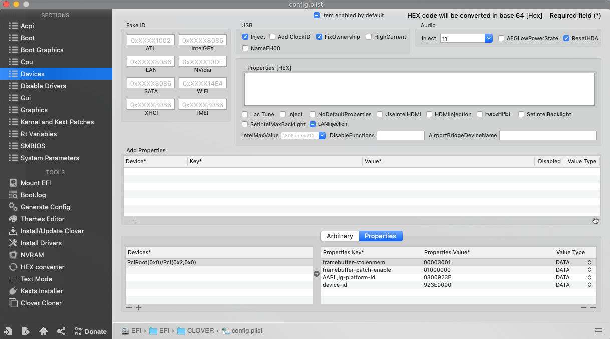
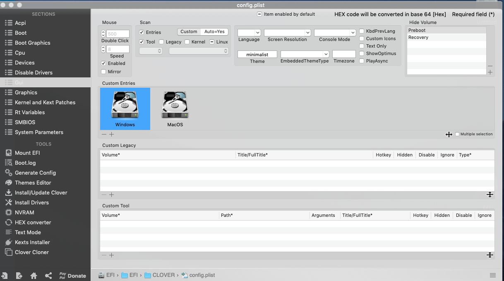
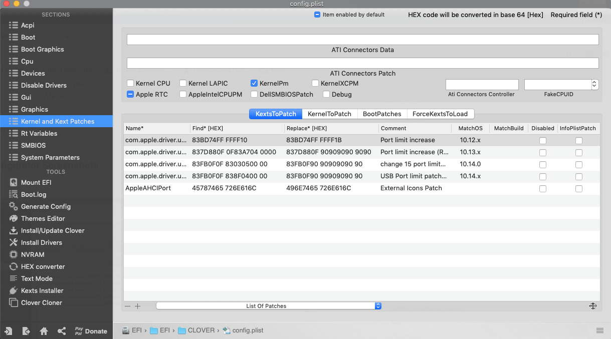
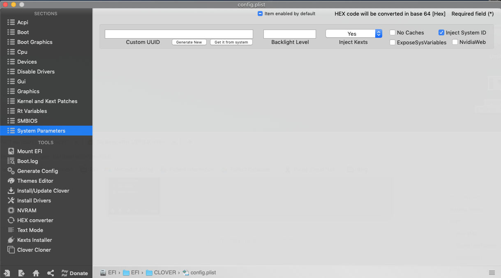
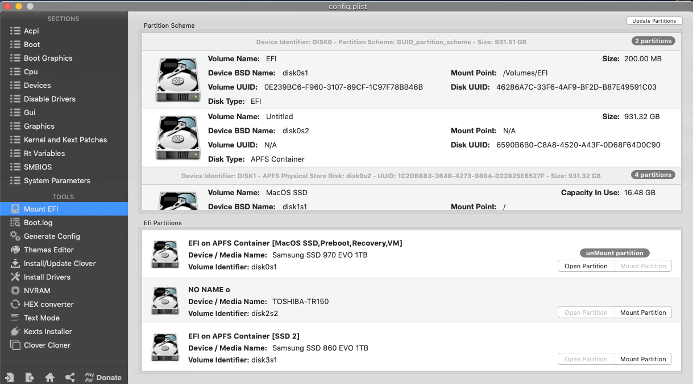
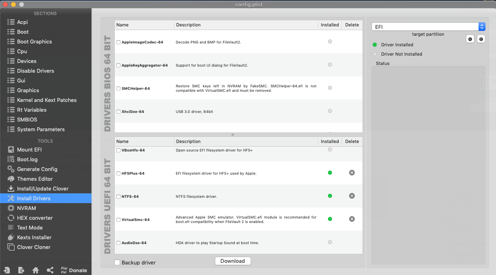

## Walkthrough of Clover Configurator

I spent some time writing a walkthrough of Clover Configurator. I did this because I wanted to understand how Clover Configurator works and what each of the parameters mean. Let’s go through each of the screens to understand what’s going on. You don’t have to read through this, but I try my best to explain what I’ve learned about each of the settings in clover and what they mean. You don’t necessarily have to read it. You can certainly boot the computer without any of this.


## ACPI


###### ACPI Section of Clover

The first screen shows ACPI configuration. This includes DSDT and SSDT patches. ACPI (Advanced Configuration and Power Interface) is an industry specification for the efficient handling of power consumption in desktop and mobile computers. ACPI specifies how a computer’s basic input/output system (BIOS), operating system, and peripheral devices communicate with each other about power usage. It provides an open standard that is OS-independent that can be used to discover and configure computer hardware components, to perform power management by (for example) putting unused components to sleep, and to perform status monitoring. The ACPI is specified by two types of tables.
      
 - **DSDT** : Differentiated System Description Table is used to describe what peripherals the machine has. Also holds information on PCI IRQ mappings and power management..
 - **SSDT** : Secondary System Description Table, which is like an extended version of DSDT.

This distinction is important because we can set DSDT and SSDT patches to modify the ACPI when the Hackintosh is loading. Several above include:
 - Change XHCI to XHC
 - Change SATA0 to SATA
 - Change GFX0 to IGPU
 - Change HDAS to HDEF

The SSDT table is seen on the bottom right on the Boot secion for Clover Configurator — SSDT-UIAC.aml is a file we will create later to specify our USB devices.

## Boot


###### Boot section of Clover

 - These set of options specify what happens when the system boots. Under arguments, you may want to check the following:
 - `Verbose (-v)`: Provides verbose mode.
 - `Slide=0` : unclear to me what this exactly does, but I found on several forums that the issue of USB drives getting ejected was avoided with this and setting `darkwake=on`. I chose a different way to avoid this USB drive ejection issue by changing my memory frequency. I am guessing both options work, but give it a go and see.
 - `Dart=0` : An extra layer of protection against Vt-d issues
 - `Debug=0x100` : This prevents a reboot during a kernel panic. Helpful to see what happens that leads to the kernel panic.
 - `Keepsyms=1` : This is a companion setting to debug=0x100. Tells the OS to print the symbols during a kernel panic.
 - Under custom flags :
 - `shikigva=40`  : This is a flag specific to iGPU.
 - `DefaultBootVolume` : This uses NVRAM to remember which volume was last booted by Clover and auto selects the same volume for booting.
- `TimeOut` : This is the number of seconds before the DefaultBootVolume auto boots. Setting this to -1 avoids all timeout, or to 0 to skip the GUI entirely. If set to 0, you can press any key at the boot to get to the GUI to show back up.


## Devices


###### Devices section of Clover


- We are going to skip ahead to this section. This is a very important section also. Pay attention to the bottom right, and choose properties. This is where we will be changing some parameters associated with activating a headless iGPU.
- The primary purpose of this section is to handle property injection for the WhateverGreen.kext here. Some key things to note here:

 **USB** :  Under this section, we ensure that Inject and FixOwnership are selected to avoid issues with hanging at a half-printed line somewhere around the Enabling Legacy Matching verbose line. You can also get past that by enabling XHCI Hand Off in BIOS.
 **Audio**:Here we set our audio to inject Layout 11 - this may or may not be compatible with your codec, but you can check on AppleALC's Supported Codec Page. For me, both `Layout 1` and `Layout 11` gave good results.  We also enabled ResetHDA which puts the codec back in a neutral state between OS reboots. This prevents some issues with no audio after booting to another OS and then back.
 **Properties**:  This section is setup via Headkaze's Intel Framebuffer Patching Guide Intel Framebuffer patching using *WhateverGreen* and *Lilu* and plugins, which is the ig-platform-id. The way we get the proper value for this is to look at the `ig-platform-id` we intend to use, then swap the pairs of hex bytes. To make matters simple, this is how it goes:
 
If you want the iGPU to drive a display : `07009B3E` 
If you want the iGPU to run headless (without display) used only for compute tasks : `0300923E`

In order for FCPX to run efficiently, Intel QuickSync should be enabled, and this as well as other functions, rely on the iGPU to offload the main GPU. Thus, I chose to run my iGPU in headless mode by setting the parameter:

```
AAPL;ig-platform-id 	0300923E	DATA 
Device-id		923E0000	DATA
```

We will discuss this more under (Enabling Headless iGPU) under *Troubleshooting* section.
We also add 2 more properties, `framebuffer-patch-enable` and `framebuffer-stolenmem`. The first enables patching via *WhateverGreen.kext*, and the second sets the min stolen memory to 19MB.


## GUI


###### GUI Section of Clover

This section sets parameters for the Clover Boot Manager (CBM) GUI that shows up when you first enter. There is nothing major here to remember since a lot of what happens here is cosmetic.

**Scan**: The only settings I've tweaked on this page are the Scan settings. I've selected Custom, then checked everything except Legacy and Kernel. This just omits some of the unbootable entries in Clover to clean up the menu.
**Hide Volumes**: I haven't added anything here, but you can hide unwanted volumes here. You can do so by either adding the volume's name, or UUID. To hide extra APFS entries, add the following to this list:
`Preboot` 
`Recovery`

To hide all Recovery partitions, add `Recovery` to the list.
Alternatively, you could also do the same by choosing custom entries. If you choose this option, you can specify which boot drives to show on clover at startup. Since I have a Windows 10 partition, for example, I can open up the options for this, as shown below. Under this, I  directly choose the UUID for the partition (**NOTE**: this is a partition UUID, not Volume UUID).

To get the UUID of a drive to hide, you can use the following terminal command:

```
Diskutil list

diskutil info diskXsY | grep -i "Partition UUID" | rev | cut -d' ' -f 1 | rev
```

Make sure to replace diskXsY with the actual disk number of the volume you'd like to hide.


## Kernel and Kext Patches


###### Kernel and Kext Patches Section in Clover

This screen shows a series of kext patches that were applied. I believe a lot of these kext patches have to do with increasing the port limit during various iterations of MacOS 10.x.x so as far as I am concerned the one that matters is really the AppleAHCIPort. This last one acts as an orange icons fix - when internal drives are hotpluggable, and treated as external drives. I believe the others can be removed safely (although I did not). For more information on what this is accomplishing, see my troubleshooting section on Custom SSDT for USB 2.0 and 3.0.

Checkboxes: We have a couple checkboxes selected here:
`Apple RTC` - this ensures that we don't have a BIOS reset on reboot. 
`KernelPM` - this setting prevents writing to MSR 0xe2 which can prevent a kernel panic at boot.

## Rt Variables 


The next three sections, Rt Variables, SMBIOS, System Parameters, have to do with setting up System Integrity Protection, iMessage and other iServices. I won’t get into the details of this here, so read up on the trouble shooting section about setting up SMBIOS and iServices. Also for privacy reasons, I am not going to display the screenshots since it contains identifiers specific to my machine.

## System Parameters


The only real important thing here is to check the box that states `Inject kexts`. This essentially tells the system to inject any and all kexts to the loading MacOS.
`InjectSystemID` : This is also checked. This tells Clover to set the SmUUID as the `System-ID` at boot. This is again reportedly important to get iServices working properly.

## Clover Tools

There are several clover tools that we will be using regularly.

### Mount EFI 

This screen helps mount any EFI partitions we need to make changes to the _EFI_Clover folder, for example.

### Install Drivers 

This tool helps you install the latest version of any UEFI drivers. Note the green indicators under the Drivers UEFI 64-Bit section. The Drivers BIOS 64 Bit are for BIOS based motherboards, and these days virtually everything is UEFI based.

### Kexts Installer 

This is an easy utility to install Kexts directly from Clover. A couple of things to remember: 
1. Always set the OS version (top right) to “Other”. To avoid conflict, I actually delete all the other OS folders in the /EFI/clover/kexts/  folder so that the only one remaining is /EFI/clover/kexts/other/.

2. You can directly check the boxes and the latest kexts from a repository will be downloaded. Some kexts such as VirtualSMC can have additional power-monitoring kexts downloaded. These are deposited in the kexts folder in the EFI partition, and NOT in the /system/library/extensions/  which is where Apple usually places its kexts. 

3. In lieu of using this Kext Installer, you could simply copy your latest kext files into the /EFI/clover/kexts/other folder also. They both accomplish the same thing.
